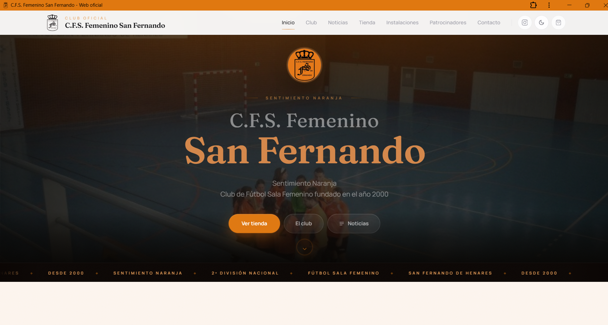
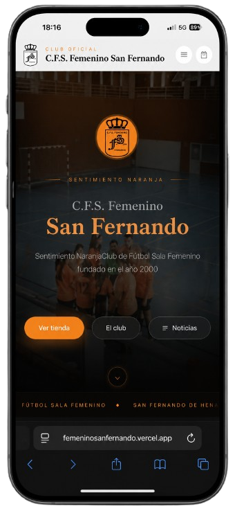
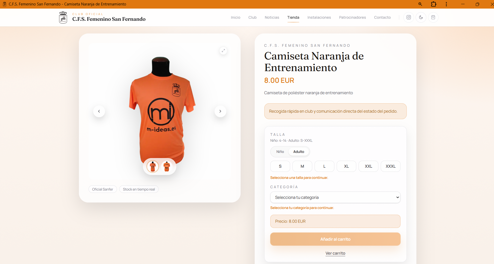
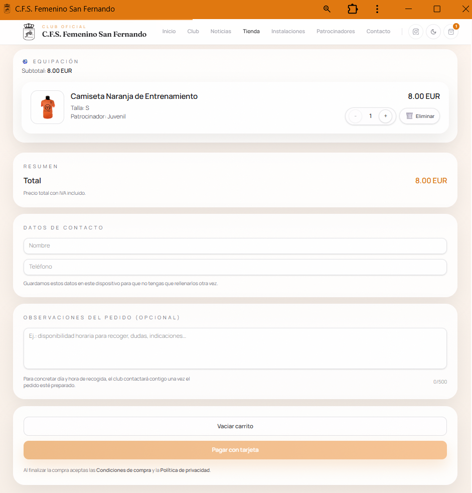
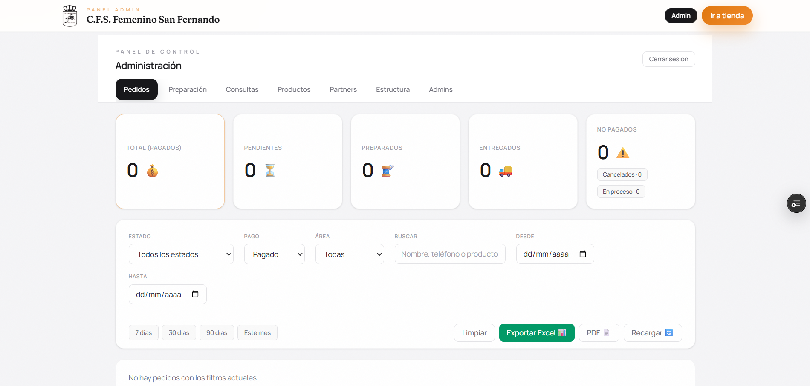

# Plataforma Web · C.F.S. Femenino San Fernando

Plataforma digital oficial desarrollada para el Club de Fútbol Sala Femenino San Fernando.

Proyecto enfocado en combinar identidad visual, experiencia móvil y venta online en una única plataforma moderna, responsive y preparada para uso real por parte de familias, afición y cuerpo técnico.

  

> El código fuente del proyecto se mantiene privado por confidencialidad y mantenimiento comercial activo.  
> Este repositorio actúa como showcase técnico y visual del producto.

 

🌐 **Web en producción:** https://femeninosanfernando.vercel.app  
💼 **Portfolio:** https://portfolio-adrisanchez.vercel.app  
📧 **Contacto:** adri.ia.dev@gmail.com

---

# El contexto

El club necesitaba una plataforma moderna para centralizar:
- presencia digital
- merchandising oficial
- comunicación visual
- experiencia móvil
- identidad de marca

La mayor parte del tráfico llega desde Instagram, WhatsApp y redes sociales del club, por lo que el rendimiento y la experiencia móvil eran prioritarios desde el inicio.

---

# La solución

Una plataforma web responsive centrada en:
- navegación rápida
- experiencia visual moderna
- compra sencilla desde móvil
- catálogo claro y accesible
- identidad visual coherente con el club

El objetivo era alejarse de soluciones genéricas y construir una experiencia más cercana a una marca deportiva moderna.

---

# Funcionalidades principales

- Catálogo de productos oficiales
- Fichas de producto optimizadas para móvil
- Variantes de talla y color
- Carrito persistente
- Proceso de compra simplificado
- Diseño responsive adaptado a redes sociales
- Integración de branding y patrocinadores
- Panel de gestión para catálogo y pedidos

---

# Capturas del producto

## Home principal

  

---

## Experiencia móvil

  

---

## Página de producto

  

---

## Carrito y proceso de compra

  

---

# Panel de administración

Además del escaparate público y el e-commerce, la plataforma incluye un panel interno de gestión diseñado para facilitar la administración diaria del club.

Funciones principales:
- Gestión de productos y catálogo
- Control de pedidos
- Gestión de imágenes y stock
- Administración de contenido
- Herramientas internas para mantenimiento operativo

  

El objetivo del panel era permitir que el club pudiera gestionar la plataforma sin depender constantemente de soporte técnico.

---

# Stack tecnológico

| Capa | Tecnología |
|---|---|
| Frontend | Next.js · TypeScript · TailwindCSS |
| E-commerce | Stripe |
| Despliegue | Vercel |
| Imágenes | next/image |
| Responsive | Mobile-first |

---

# Decisiones técnicas

### Mobile-first desde el principio

La mayoría del tráfico llega desde redes sociales móviles, por lo que toda la experiencia se diseñó primero para smartphone y después para escritorio.

---

### Diseño alineado con la identidad del club

La plataforma se construyó priorizando branding, sponsors, colores y coherencia visual frente a plantillas genéricas de e-commerce.

---

### Rendimiento y simplicidad

Cada flujo se simplificó para usuarios no técnicos:
- navegación clara
- compra rápida
- mínima fricción
- carga rápida de imágenes y catálogo

---

### Next.js para rendimiento y SEO

Uso de renderizado optimizado e imágenes eficientes para mejorar velocidad, posicionamiento y experiencia general.

---

# Estado actual

- Plataforma en producción
- Cliente real activo
- Mantenimiento continuo
- Evolución visual y funcional activa

---

# Contacto

¿Necesitas una plataforma similar para un club, asociación o negocio?

📧 **adri.ia.dev@gmail.com**  
🌐 **Portfolio:** https://portfolio-adrisanchez.vercel.app  
💼 **LinkedIn:** https://www.linkedin.com/in/adrian-sanchez-guerrero
